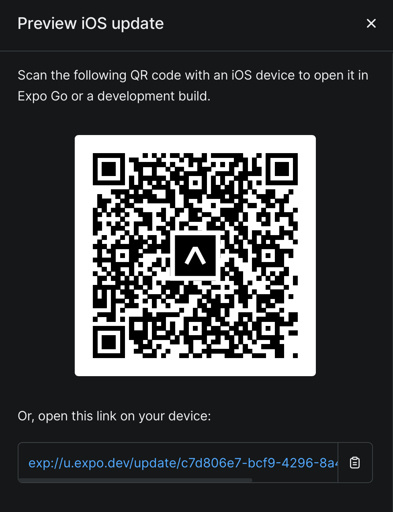
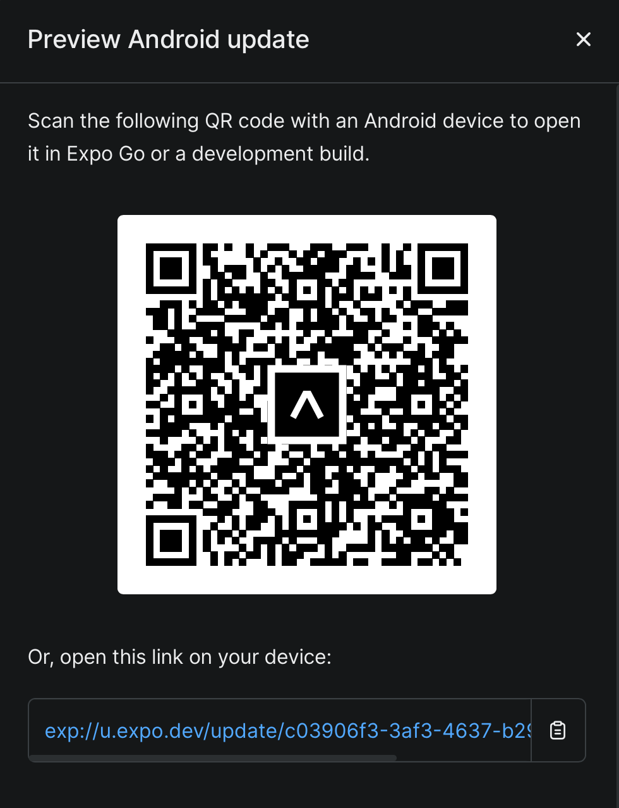

**Student:** https://github.com/randomoi/

**IMPORTANT** Please review "important_files" folder, which contains the following files

1. project demo
2. report
3. expo EAS QR codes 
4. wireframes
5. mid-fidelity prototypes 
6. high-fidelity prototypes
7. user flow diagram

## LINKS

**Before proceeding, please ensure that you have downloaded the Expo Go app on your mobile device. Without the Expo Go app installed, the QR codes provided below will not function properly. You can find Expo Go on the App Store for iOS devices or the Google Play Store for Android devices. Once you have the app installed, you'll be ready to scan the QR codes and use the application.**

1. [Expo iOS Link](exp://u.expo.dev/update/c7d806e7-bcf9-4296-8a4b-8ef203e1ee80): this link suppose to be opened on iOS device. The link will not work in browser. I've included a QR CODE as well. 

2. [Expo Adnroid Link](exp://u.expo.dev/update/c03906f3-3af3-4637-b29d-55af7bcd903f): this link suppose to open on Android device, but I don't have an Adnroid to test it. I've included a QR CODE as well. 

- **Troubleshooting**: If for any reason clickable links don't work in ***pdf***, please visit ***.md*** file to copy and paste links on iPhone. Since I do not own Android phone, I can’t validate if Android link works. Unfortunately, none of my free testers own an Android. If all fails, please run my application on local environment. Thank you.

## DEVELOPMENT
The project was developed primarily on MacOS, however, camera feature forced me to do some development on friend's Windows computer as "expo-camera" doesn't work on XCode Simulator. 

My Mac computer is fairly old and doesn’t have enough processing power to handle Android Studio, therefore, I had to partially work on Windows.

## INSTRUCTIONS ON HOW TO RUN THE APPLICATION IN TERMINAL
Note that XCode or Android Studio must be installed to run the simulator to display the app.   

1. navigate to the directory where project was downloaded
2. navigate to the project files directory

        cd [XXX]

3. navigate to the app project directory

        cd [XXX]

4. install node_modules (npm --version = 9.7.2)

        npm install

5. start expo by running the following command

        npx expo start

6. select "i" to run XCode simulator or "a" to run in Android Studio emulator

### **IMPORTANT:** XCode simulator will not work for camera feature. 

Please see [expo documentation](https://docs.expo.dev/workflow/ios-simulator/).

## INSTRUCTIONS ON HOW TO RUN TESTS

To run all tests, please run following command.

        npx jest tests

To run individual tests, please run following commands.

        npx jest tests/HeaderAppIcon.test.js

        npx jest tests/ImageSelector.test.js

        npx jest tests/SuccessAlert.test.js

## CREDITS
1. [Logo Credit](https://www.freepik.com/free-vector/initial-letter-b-check-mark-logo-ideas-inspiration-logo-design-template-vector-illustration-isolated-white-background_21003339.htm#query=to%20do%20logo&position=1&from_view=search&track=ais)
2. [Emoji Party Face Credit](https://emojipedia.org/partying-face)
3. [Emoji Nerd Face Credit](https://emojipedia.org/nerd-face)

